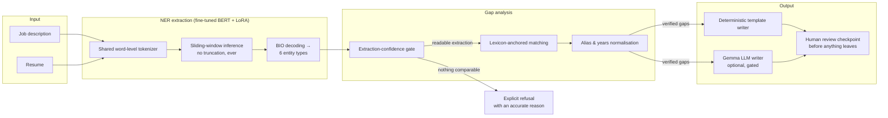

# GenFeedback

**An end-to-end NLP system for resume screening with verifiable, human-supervised candidate feedback.**

GenFeedback reads a job description and a resume, extracts structured requirements and evidence
with a fine-tuned transformer NER model, computes a *verified* skills gap, and drafts a
constructive, respectful feedback email — while refusing to fabricate a single claim it cannot
support. It was developed as a Master's final dissertation project, and its central thesis is an
engineering one:

> **In high-stakes automation, a system's refusal behaviour matters as much as its accuracy.**
> A screening tool that silently turns noise into confident rejection reasons is worse than no
> tool at all. Every layer of GenFeedback is designed so that uncertainty surfaces to a human
> instead of reaching a candidate.

---

## System at a glance



Six entity types are extracted from both documents — technical skills, tools, soft skills,
designation, years of experience, qualifications — and compared on evidence, not string equality.

---

## What makes it interesting

### 1. A label-alignment architecture, not a post-processing pile

Token-classification pipelines usually die a death of a thousand heuristics: `"C++"` becomes
`"C"`, `"Node.js"` splits in half, and a curated noise-word list grows forever. GenFeedback
solves the class of bug instead of the instances:

- **One shared regex tokenizer** (`genfeedback/tokenization.py`) is used by *both* the data
  generator and inference, so training labels and predictions can never desynchronise.
- Text is fed to BERT as **pre-split words** (`is_split_into_words=True`); each word takes the
  prediction of its **first subword**; entity text is reconstructed by re-joining the *original*
  words. Surface forms (`C++`, `C#`, `scikit-learn`) and casing survive exactly.
- Post-processing is therefore trivial — deduplicate and trim edge punctuation. No noise-word
  filtering exists anywhere in the extraction path; the matcher keeps one principled boilerplate
  stop-list, applied only at the requirement level — it never touches the model's output.

### 2. Sliding-window inference — long documents are never silently truncated

A two-page resume exceeds BERT's 512-subword limit, and the conventional `truncation=True`
silently discards the end of the document — which is where the skills section usually lives.
GenFeedback's inference (`genfeedback/ner/inference.py`) instead:

- budgets windows in **exact subwords** (accounting for special tokens) from a per-word length table,
- overlaps adjacent windows and **snaps the seam** to a point where both windows agree the label
  is `O`, so an entity straddling a boundary is never cut in half,
- merges to one document-length label sequence — the public API is unchanged and no input length
  is ever refused or clipped. The window and overlap sizes are derived from the measured
  span-length distribution of the data (documented in the module), not guessed.

### 3. Synthetic supervision as a designed artifact

Rather than hand-labelling a small corpus, the training set is produced by a **template
grammar** (`genfeedback/datagen.py`): 26 sentence/paragraph templates slot-filled from a curated
vocabulary, emitting CoNLL with **programmatically consistent BIO labels** — filler words are
provably `O`, list rendering matches real prose, and the corpus regenerates byte-identically
from a seed. External BIO corpora can be merged in, guarded by a **strict loader**
(`genfeedback/data.py`) that raises on unknown tags, malformed lines and invisible characters
buried inside a token, and strips BOMs and edge zero-width characters with a loud warning — a
mislabelled corpus fails loudly at load time, never silently at evaluation time.

### 4. Parameter-efficient training with honest evaluation

Fine-tuning (`genfeedback/ner/train.py`) uses **LoRA** adapters (r=16 on query/value; the
classification head is trained in full, and everything is merged back for zero-cost inference), class-weighted loss over present
classes only, seeded runs, early stopping, and **entity-level seqeval P/R/F1** — not the
token-level accuracy that flatters sequence labellers. The training corpus is synthetic-first by
design, and the system is engineered around that honesty (see the lexicon anchor below) rather
than around pretending the model generalises further than it does.

### 5. Lexicon-anchored gap analysis — extractor noise cannot become a gap

The most consequential design decision in the project. Raw NER output is noisy in ways no
downstream string logic can repair: span boundaries vary with context, and a model *will*
occasionally tag a city or a person's name as a tool. So the matcher
(`genfeedback/matching.py` + `genfeedback/lexicon.py` + `genfeedback/normalize.py`) inverts the
usual burden of proof:

- A requirement can become a candidate-facing gap **only if it resolves to a curated lexicon of
  known skills and qualifications** — the same vocabulary the model was trained on, imported
  from the generator so the two can never drift apart.
- Evidence is pooled **across categories** (a skill counts wherever the extractor filed it) and
  normalised through an **alias table** (`AWS` ⇄ `Amazon Web Services`, `ML` ⇄ `machine
  learning`) so category noise and surface variants cannot fabricate a gap.
- **Years of experience are compared numerically** (`five years`, `5+ years`, `3–5 years` all
  parse; employment date ranges are recognised and abstained on), so a six-year engineer is
  never told to acquire "5 years".
- **Degrees are compared by level** (bachelor < master < doctorate); if either side states no
  rankable degree the comparison abstains — visibly.
- Anything that cannot be verified is **never dropped silently**: it surfaces as an
  operator-facing note ("could not check these items against the resume"), keeping the human
  informed of exactly what the automation could not do.

### 6. An extraction-confidence gate on every exit

`genfeedback/quality.py` decides whether the system has *anything defensible to say*. Empty
input, a scanned-PDF paste, non-Latin text the model was never trained on, or a job description
with no recognisable requirement all produce an **explicit refusal with an accurate reason** —
never a cheerful "no gaps found", which a failure would otherwise masquerade as. The gate is
enforced at **every** candidate-facing surface: the Streamlit UI, both CLI entry points, and the
HTTP API. It is deliberately asymmetric: a job description with no recognisable requirement
refuses outright, while a readable resume with no recognisable skills remains assessable — a
genuinely unqualified candidate is a valid outcome, not an error.

### 7. Human-in-the-loop, enforced in code

The system drafts; a person decides. The UI labels every email an **unreviewed AI-generated
draft**, requires an explicit *"I have reviewed this draft"* acknowledgement before the download
unlocks, and **invalidates stale results** — editing either input withdraws the previous
analysis so one candidate's letter can never be sent while another's resume is on screen.
This is a deliberate position on responsible automation in hiring, not a disclaimer.

### 8. Deployment as a two-service system

The heavyweight LLM is decoupled from the UI behind a **FastAPI microservice** (`gemma_api.py`)
that loads the model once at startup and exposes `/health` — probed by the compose
healthcheck, and the same seam a Kubernetes startup probe would use — returning proper 4xx/503
semantics for ungateable input or a not-yet-loaded model. A multi-stage
**Dockerfile** (slim runtime, non-root user, cache-friendly layer ordering) and a
**docker-compose** stack wire the two services by name, persist the model cache in a named
volume, and health-check with stdlib Python.

---

## Quickstart (CPU-only, no accounts needed)

Python 3.12 recommended. No GPU required — training and inference run on CPU; CUDA is used
automatically when present.

```bash
git clone https://github.com/CaptiveON/genfeedback.git
cd genfeedback
python3 -m venv .venv && source .venv/bin/activate
pip install -r requirements.txt

# 1. Generate the training corpus (seeded, reproducible)
python -m genfeedback.datagen

# 2. Fine-tune the NER model  →  artifacts/bert_ner   (a few minutes on a laptop)
python -m genfeedback.train_bert

# 3. Analyse the bundled sample pair — entities, verified gaps, operator notes
python -m genfeedback.extract --jd-file data/sample_jd.txt --resume-file data/sample_resume.txt

# 4. Full UI
streamlit run app.py
```

The UI and CLI are fully functional at this point using the deterministic template writer — no
external services, no accounts, no LLM required.

### Optional: LLM-written feedback (Gemma)

The Gemma writer gives the model *both* entity sets and lets it reason about the gaps itself.
Gemma models are gated on Hugging Face — accept the licence on the model page, then:

```bash
hf auth login                       # or: export HF_TOKEN=hf_...
streamlit run app.py                # pick "Gemma LLM (Hugging Face)" in the sidebar
```

The default model is `google/gemma-4-E2B-it` (multimodal, ~10 GB download). On a modest machine,
use the lighter text-only model instead:

```bash
export GENFEEDBACK_GEMMA_BASE=google/gemma-2-2b-it
```

On Apple Silicon, prefix commands with `PYTORCH_ENABLE_MPS_FALLBACK=1`.

### Optional: the two-service Docker stack

Train the NER model first (step 2 above — the image bakes the artifact in), then:

```bash
HF_TOKEN=hf_xxx docker compose up --build
# UI on http://localhost:8501, model service on http://localhost:8000
```

### CLI reference

```bash
python -m genfeedback.extract                    # built-in demo pair
python -m genfeedback.extract --jd "..." --resume "..."
python -m genfeedback.extract --jd-file jd.txt --resume-file cv.txt --json   # machine-readable
python -m genfeedback.feedback_demo              # full pipeline incl. Gemma, in the terminal
python -m genfeedback.datagen --n 1200 --seed 42 # same seed → byte-identical corpus
```

---

## Project structure

```
genfeedback/
  config.py          # single source of truth: paths, models, hyperparameters (env-overridable)
  labels.py          # the 6-type BIO label scheme
  tokenization.py    # the shared word-level tokenizer (the alignment keystone)
  datagen.py         # template-grammar synthetic corpus generator (CLI)
  preprocessing.py   # display cleaning; stopword removal deliberately NOT applied before NER
  data.py            # strict CoNLL loader — fails loudly, never corrupts silently
  lexicon.py         # curated skill/qualification vocabulary; recognise() anchor
  normalize.py       # canonicalisation, alias table, numeric years parsing
  matching.py        # verified gap analysis + operator notes
  quality.py         # extraction-confidence gate
  ner/               # dataset alignment, LoRA training, sliding-window inference
  feedback/          # template writer, Gemma prompting/generation, HTTP client
  extract.py         # CLI: entities + gaps (no LLM needed)
  feedback_demo.py   # CLI: full pipeline end to end
  train_bert.py      # CLI: fine-tune and save the NER model
tests/               # pytest suite: tokenizer, loader, matching, gate, e2e pipeline
app.py               # Streamlit UI (review-gated download, stale-result protection)
gemma_api.py         # FastAPI model microservice
Dockerfile           # multi-stage, non-root, slim runtime
docker-compose.yml   # two-service local stack
```

All paths, model ids and hyperparameters live in `genfeedback/config.py`; paths, model ids,
seeds and the LoRA settings are overridable via `GENFEEDBACK_*` environment variables
(`GENFEEDBACK_DATA`, `GENFEEDBACK_BERT_DIR`, `GENFEEDBACK_GEMMA_BASE`, `GENFEEDBACK_COMPANY`, …).

### Data format

CoNLL-style, one `token tag` pair per line, blank line between samples:

```
Python B-TECHNICALSKILL
developer O

5 B-YEAROFEXPERIENCE
years I-YEAROFEXPERIENCE
```

---

## Verification approach

The repository ships a test suite covering the alignment tokenizer, the strict loader, years
parsing, the gap engine's core guarantees, the confidence gate, and (once the model is trained)
end-to-end extraction including the no-truncation property:

```bash
python -m pytest tests/ -q
```

Beyond the suite, the pipeline was hardened by **systematic adversarial testing**:
perfect-match resumes (must yield *zero* gaps), genuinely under-qualified candidates (every true
gap must survive), overqualified candidates (more experience must never read as less),
degenerate inputs (empty, whitespace-only, zero-width characters), unreadable inputs (scanned-PDF
pastes, base64/HTML/hex dumps, binary structure), non-Latin scripts, header-only resumes,
requirement-free job descriptions, and adversarial CoNLL (unknown tags, BOMs, invisible
characters, malformed lines). The design goal throughout: **every failure mode is either handled
or loud — never silent.**

## Honest limitations

- The NER model is trained on synthetic-first data with a finite vocabulary; out-of-vocabulary
  skills are surfaced as operator notes rather than gaps (a deliberate false-negative bias — the
  system understates rather than fabricates).
- Entity extraction on free-form prose still shows raw-model noise in the *diagnostic* panels;
  the lexicon anchor keeps it out of anything candidate-facing.
- The matcher's alias/lexicon tables are curated and finite; growing them is a safe, additive
  maintenance task.
- The lexicon anchor bounds *what* a gap can be, not whether resume evidence was found: if the
  extractor misses a skill the resume genuinely states, that gap can still be reported. The
  enforced human review step exists precisely for this.

## Ethics

Automated reasoning about people's livelihoods demands guardrails, not just accuracy. GenFeedback
treats the human reviewer as a load-bearing component: the system cannot emit an unverifiable
claim, cannot dress a failed extraction up as a favourable result, and cannot release a feedback
letter that a person has not explicitly reviewed. Use it as decision *support* — never as a
decision maker.

---

## License

MIT — see [LICENSE](LICENSE).

## Author

**Muhammad Adnan** — [github.com/CaptiveON](https://github.com/CaptiveON)

Developed as the final dissertation project for a Master's degree.
